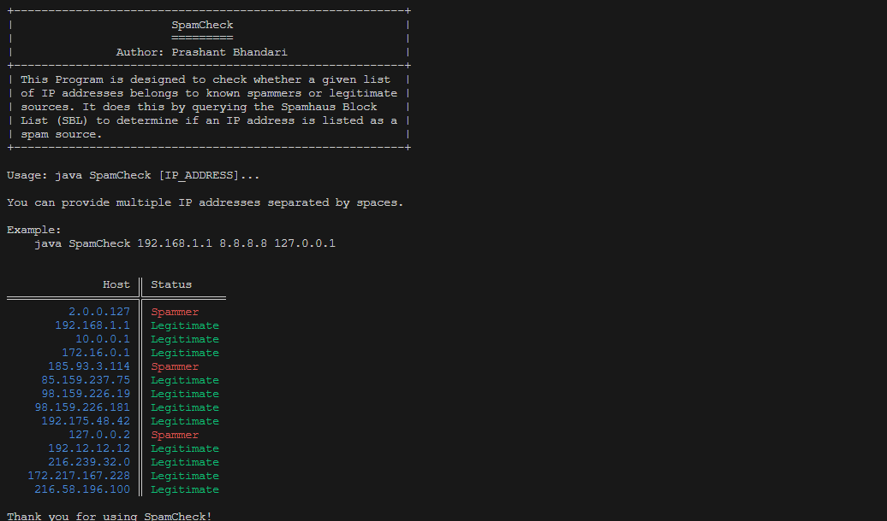

# **SpamCheck**

You can check if an IP address is listed on the ``Spamhaus blacklist`` by performing a reverse DNS lookup on the IP address using the ``Spamhaus DNSBL (DNS-based Blackhole List)`` service. Here's how to do it:

**Step-1 :** Open a command prompt or terminal window on your computer.

**Step-2 :** Type the following command to perform a reverse DNS lookup on the IP address using the ``Spamhaus DNSBL`` service:

```bat
nslookup <IP address>.zen.spamhaus.org
```
> Note : Replace ``<IP address>`` with the actual IP address you want to check.

**Example:** for ``127.0.0.2``
```bat
nslookup 2.0.0.127.zen.spamhaus.org
```

**Step-3 :** If the IP address is listed on the Spamhaus blacklist, the DNS lookup will return a result with the message ``"127.0.0.x"``, where ``"x"`` is a number between ``1`` and ``4``. Each number represents a different ``Spamhaus blacklist``, as follows:

- ``127.0.0.2`` : SBL - Spamhaus Block List
- ``127.0.0.3`` : SBL - CSS (Composite Blocking List) Block List
- ``127.0.0.4`` : XBL - Exploits Block List
- ``127.0.0.9`` : PBL - Policy Block List

If the ``DNS`` lookup returns one of these results, then the IP address is listed on the corresponding blacklist and is likely a known ``spammer``.

**Step-4 :** If the DNS lookup returns a result with a message other than ``"127.0.0.x"``, or if the lookup fails to return a result, then the IP address is not listed on the Spamhaus blacklist.

Let`s do it Programatically:

**Step-1 :** Imports and Class Declaration.
```Java
import java.net.*;
import java.util.Scanner;
import java.util.regex.Pattern;

public class SpamCheck {
    // Constants and methods will go here
}
```
- **Imports:**
    - ``java.net.*``: For network-related classes like ``InetAddress``.
    - ``java.util.Scanner``: For reading user input from the console.
    - ``java.util.regex.Pattern``: For working with regular expressions.

- **Class Declaration:** The main class ``SpamCheck`` encapsulates all the constants and methods for the program.

**Step-2 :** Banner and Constants

```Java
public static final String BANNER = """
+---------------------------------------------------------+
|                       SpamCheck                         |
|                       =========                         |
|               Author: Prashant Bhandari                 |
+---------------------------------------------------------+
| This Program is designed to check whether a given list  |
| of IP addresses belongs to known spammers or legitimate |
| sources. It does this by querying the Spamhaus Block    |
| List (SBL) to determine if an IP address is listed as a |
| spam source.                                            |
+---------------------------------------------------------+

Usage: java SpamCheck [IP_ADDRESS]...
    
You can provide multiple IP addresses separated by spaces.

Example:
    java SpamCheck 192.168.1.1 8.8.8.8 127.0.0.1
""";

public static final String BLACKHOLE = "zen.spamhaus.org";

// ANSI escape codes for text formatting
public static final String ANSI_RED = "\u001B[31m";
public static final String ANSI_GREEN = "\u001B[32m";
public static final String ANSI_BLUE = "\u001B[34m";
public static final String ANSI_RESET = "\u001B[0m";
```
- **``BANNER``:** A multiline string providing a description of the program, usage instructions, and an example.
- **``BLACKHOLE``:** The domain name for querying the **Spamhaus Block List**.
- **ANSI Escape Codes:** Constants for text color formatting:
    - ``ANSI_RED``, ``ANSI_GREEN``, ``ANSI_BLUE``: For coloring text in red, green, and blue respectively.
    - ``ANSI_RESET``: Resets the text color to the default.

**Step-3 :** Validating IP Address.

```Java
private static boolean isValidIP(String ip) {
    String zeroTo255 = "([0-9]{1,2}|1[0-9]{2}|2[0-4][0-9]|25[0-5])";
    String regex = zeroTo255 + "\\." + zeroTo255 + "\\." + zeroTo255 + "\\." + zeroTo255;
    Pattern pattern = Pattern.compile(regex);
    return pattern.matcher(ip).matches();
}
```

- **``isValidIP`` Method :** Checks if a given string is a valid ``IPv4`` address.
    - Regex Components:
        - ``zeroTo255``: Matches any number from ``0`` to ``255``.
        - ``regex``: Combines four ``zeroTo255`` patterns separated by dots to match the full IP format (e.g., ``192.168.1.1``).
    - Pattern Matching: Uses the compiled ``regex`` pattern to match the input IP address.

**Step-4 :** Checking If IP Is a Spammer.

```Java
private static boolean isSpammer(String ip) {
    try {
        InetAddress address = InetAddress.getByName(ip);
        byte[] quad = address.getAddress();
        String query = BLACKHOLE;
        for (byte octet : quad) {
            int unsignedByte = octet < 0 ? octet + 256 : octet;
            query = unsignedByte + "." + query;
        }
        InetAddress.getByName(query);
        return true;
    } catch (UnknownHostException e) {
        return false;
    }
}
```
- **``isSpammer`` Method:** Constructs a ``DNS`` query to check if the IP is listed in the **Spamhaus Block List**.
    - Convert IP to Bytes: Uses ``InetAddress`` to get the byte representation of the IP address.
    - ``Reverse DNS`` Query Construction: Constructs a reverse ``DNS`` query string:
        - Converts each byte of the IP to an unsigned integer.
        - Constructs the query in the format ``unsSSignedByte4.unsignedByte3.unsignedByte2.unsignedByte1.zen.spamhaus.org``.
    - ``DNS`` Query: Uses ``InetAddress.getByName(query)`` to perform the DNS query.
        - If the query resolves, the IP is a spammer (returns ``true``).
        - If ``UnknownHostException`` is thrown, the IP is not a spammer (returns ``false``).

**Step-5 :** Main Method.
```Java
public static void main(String[] args) {
    System.out.println(BANNER);
    if (args.length == 0) {
        System.out.println("No IP addresses provided as arguments. Please enter IP addresses interactively.");
        Scanner scanner = new Scanner(System.in);
        System.out.println("Enter IP addresses separated by spaces:");
        String input = scanner.nextLine();
        args = input.split("\\s+");
    }
    System.out.println();
    System.out.printf(" %17s ║ %s\n", "Host", "Status");
    System.out.println("═══════════════════╬════════════");
    for (String ip : args) {
        if (isValidIP(ip)) {
            if (isSpammer(ip)) {
                System.out.printf(" %s%17s%s ║ %s%s%s\n", ANSI_BLUE, ip, ANSI_RESET, ANSI_RED, "Spammer", ANSI_RESET);
            } else {
                System.out.printf(" %s%17s%s ║ %s%s%s\n", ANSI_BLUE, ip, ANSI_RESET, ANSI_GREEN, "Legitimate", ANSI_RESET);
            }
        } else {
            System.out.printf(" %s%17s%s ║ %s%s%s\n", ANSI_BLUE, ip, ANSI_RESET, ANSI_RED, "Invalid IP", ANSI_RESET);
        }
    }
    System.out.println("\nThank you for using SpamCheck!");
}
```
- **Prints Banner:** Displays the program banner.
- **Command-Line Arguments Check:**
    - If no IP addresses are provided as arguments, prompts the user to enter IP addresses interactively.
    - Reads input from the console and splits it into individual IP addresses.
- **Prints Table Header:** Displays a formatted table header for results.
- **Iterates Through IP Addresses:**
    - Validates IP: Checks if the IP address is valid using ``isValidIP``.
    - Checks If Spammer: Uses ``isSpammer`` to check if the IP is listed in the **Spamhaus Block List**.
    - Prints Results: Displays the IP address and its status (``spammer``, ``legitimate``, or ``invalid``) with appropriate color formatting.
- **Thank You Message:** Prints a thank you message at the end.

**Command:**
```bash
java SpamCheck 2.0.0.127 192.168.1.1 10.0.0.1 172.16.0.1 185.93.3.114 85.159.237.75 98.159.226.19 98.159.226.181 192.175.48.42 127.0.0.2 192.12.12.12 216.239.32.0 172.217.167.228 216.58.196.100
```

**Output:**

<div align="center">



</div>